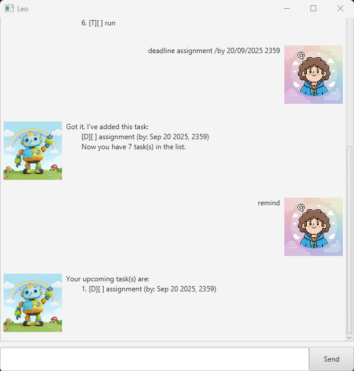
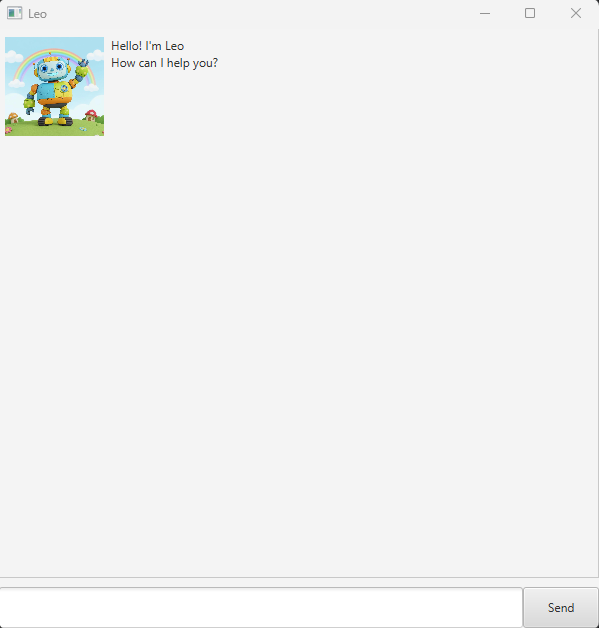
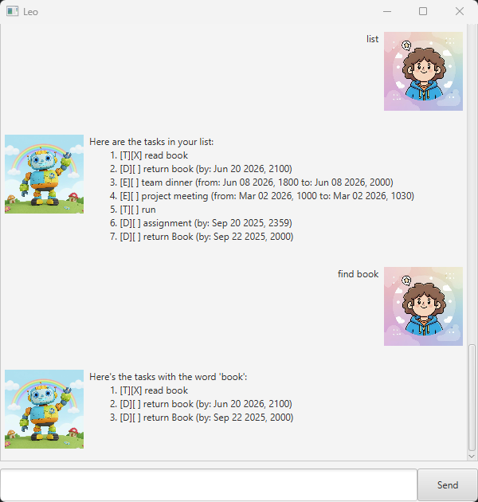

# Leo User Guide



Leo is a lightweight, beginner-friendly task manager that makes productivity feel effortless. With its simple text-based interface, you can easily plan your days, stay on top of tasks, and let reminders keep you on track without any clutter.

- [Quick Start](#quick-start)
- [Features](#features)
  - [Adding a Basic Task](#adding-a-basic-task-todo)
  - [Adding a Task with Deadline](#adding-a-task-with-deadline-deadline)
  - [Adding a Task with Start and End Date](#adding-a-task-with-start-and-end-date-event)
  - [Listing all tasks](#listing-all-tasks-list)
  - [Finding tasks by keyword](#finding-tasks-by-keyword-find)
  - [Checking for Upcoming Tasks](#checking-for-upcoming-tasks-remind)
  - [Marking a Task as Completed](#marking-a-task-as-completed-mark)
  - [Marking a Task as Incomplete](#marking-a-task-as-incomplete-unmark)
  - [Deleting a Task](#deleting-a-task-delete)
- [Command Summary](#command-summary)

## Quick Start
1. Ensure you have Java 17 or above installed on your computer.
2. Download the latest `.jar` file from [here](https://github.com/xavychin/ip/releases).
3. Copy the file to the folder you want to use as Leo's home folder.
4. Open a command terminal, `cd` into the folder you put your `.jar` file in, and run: 

    ```java -jar Leo.jar``` 

    A GUI similar to the one below will appear:



## Features

<a name="adding-a-basic-task-todo"></a>
### Adding a Basic Task: <code>todo</code>
Adds a simple task with only a description to the list.

Format: `todo <task description>`

Examples: 
- `todo borrow book`
- `todo join sports club`

<a name="adding-a-task-with-deadline-deadline"></a>
### Adding a Task with Deadline: <code>deadline</code>
Adds a task with a description and a deadline to the list.

Format: `deadline <task description> /by <dd/MM/yyyy HHmm>`

Examples:
- `deadline return book /by 20/06/2026 2100`
- `deadline assignment /by 18/09/2025 2359`

<a name="adding-a-task-with-start-and-end-date-event"></a>
### Adding a Task with Start and End Date: <code>event</code>
Adds a task with a description and a duration (start and end date/time).

Format: `event <task description> /from <dd/MM/yyyy HHmm> /to <dd/MM/yyyy HHmm>`

Examples:
- `event team dinner /from 08/06/2026 1800 /to 08/06/2026 2000`
- `event project meeting /from 02/03/2026 1000 /to 02/03/2026 1130`

<a name="listing-all-tasks-list"></a>
### Listing all tasks: <code>list</code>
Displays a list of all current tasks.

Format: `list`

<a name="finding-tasks-by-keyword-find"></a>
### Finding tasks by keyword: <code>find</code>
Searches for tasks containing the keyword.

Format: `find <keyword>`

- Search is case-insensitive (`book` matches `Book`)
- You can search by **task description** or **date**
- Only one keyword can be searched

Examples:
- `find meeting` returns all tasks with `meeting` or `Meeting`
- `find book` returns all tasks with `book` or `Book`



<a name="checking-for-upcoming-tasks-remind"></a>
### Checking for Upcoming Tasks: <code>remind</code>
Displays a list of tasks due in the upcoming week.

Format: `remind`

- Runs automatically at startup to alert you about upcoming deadlines

<a name="marking-a-task-as-completed-mark"></a>
### Marking a Task as Completed: <code>mark</code>
Marks a specified task in the list as completed.

Format: `mark <task index>`

Examples:
- `list` followed by `mark 2` marks the second task in the list as completed

<a name="marking-a-task-as-incomplete-unmark"></a>
### Marking a Task as Incomplete: <code>unmark</code>
Reverts a specified completed task in the list back to incomplete.

Format: `unmark <task index>`

Examples:
- `list` followed by `unmark 2` marks the second task in the list as incomplete

<a name="deleting-a-task-delete"></a>
### Deleting a Task: <code>delete</code>
Removes a specified task in the list.

Format: `delete <task index>`

Examples:
- `list` followed by `delete 1` deletes the first task in the list

## Command Summary
<table>
    <tr>
        <th>Action</th>
        <th>Format</th>
        <th>Example</th>
    </tr>
    <tr>
        <td rowspan="3">Add</td>
        <td>todo &lt;task description&gt;</td>
        <td>todo borrow book</td>
    </tr>
    <tr>
        <td>deadline &lt;task description&gt; /by &lt;dd/MM/yyyy HHmm&gt;</td>
        <td>deadline assignment /by 18/09/2025 2359</td>
    </tr>
    <tr>
        <td>event &lt;task description&gt; /from &lt;dd/MM/yyyy HHmm&gt; /to &lt;dd/MM/yyyy HHmm&gt;</td>
        <td>event project meeting /from 02/03/2026 1000 /to 02/03/2026 1130</td>
    </tr>
    <tr>
        <td>List</td>
        <td>Format: list</td>
        <td>-</td>
    </tr>
    <tr>
        <td>Search</td>
        <td>find &lt;keyword&gt;</td>
        <td>find meeting returns all tasks with meeting or Meeting</td>
    </tr>
    <tr>
        <td>Reminder</td>
        <td>remind</td>
        <td>-</td>
    </tr>
    <tr>
        <td>Mark</td>
        <td>mark &lt;task index&gt;</td>
        <td>mark 2</td>
    </tr>
    <tr>
        <td>Unmark</td>
        <td>unmark &lt;task index&gt;</td>
        <td>unmark 3</td>
    </tr>
    <tr>
        <td>Delete</td>
        <td>delete &lt;task index&gt;</td>
        <td>delete 1</td>
    </tr>
</table>